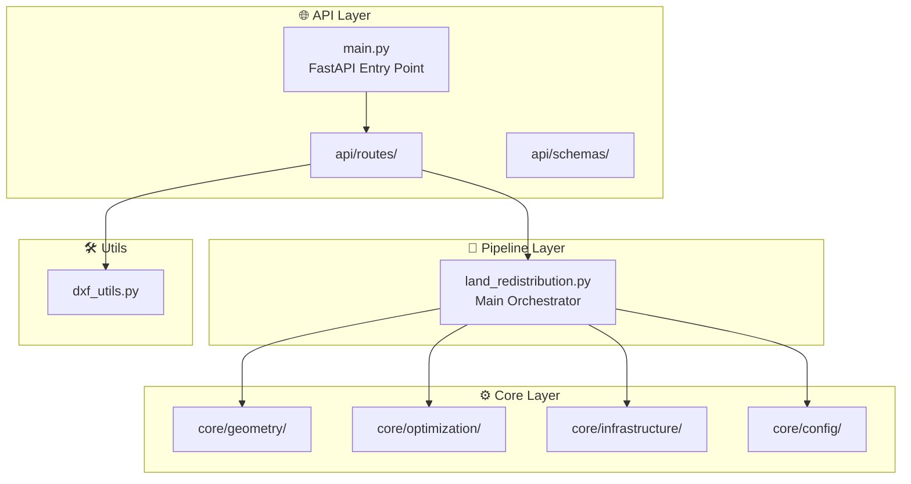
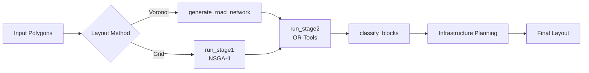
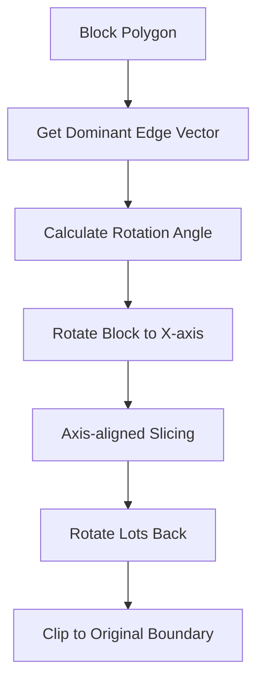
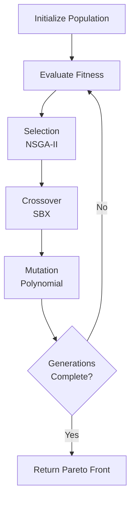
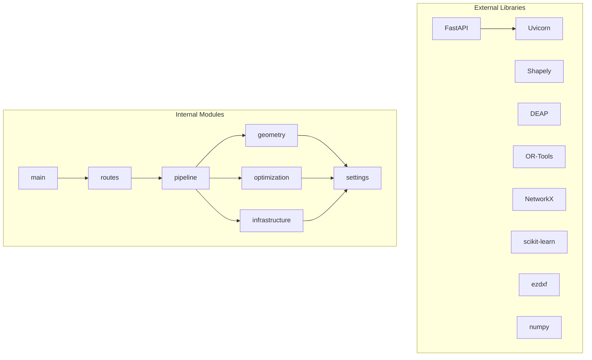

# Phân Tích Chi Tiết Backend - Land Redistribution Algorithm

> Tài liệu phân tích kỹ thuật các file, function và thuật toán trong `algorithms/backend`

## Tổng Quan Kiến Trúc



---

## 📁 Cấu Trúc Thư Mục

```
algorithms/backend/
├── main.py                    # FastAPI application entry point
├── api/
│   ├── routes/
│   │   ├── optimization_routes.py   # Land optimization endpoints
│   │   └── dxf_routes.py            # DXF file handling endpoints
│   └── schemas/
│       ├── request_schemas.py       # Pydantic request models
│       └── response_schemas.py      # Pydantic response models
├── core/
│   ├── config/
│   │   └── settings.py              # Algorithm configuration
│   ├── geometry/
│   │   ├── orthogonal_slicer.py     # Lot subdivision slicing
│   │   ├── voronoi.py               # Voronoi diagram generation
│   │   ├── shape_quality.py         # Shape quality analysis
│   │   └── polygon_utils.py         # Geometry utilities
│   ├── optimization/
│   │   ├── grid_optimizer.py        # NSGA-II genetic algorithm
│   │   └── subdivision_solver.py    # OR-Tools CP-SAT solver
│   └── infrastructure/
│       ├── network_planner.py       # MST electrical network
│       ├── transformer_planner.py   # K-Means transformer placement
│       └── drainage_planner.py      # Gravity flow drainage
├── pipeline/
│   └── land_redistribution.py       # Main pipeline orchestration
└── utils/
    └── dxf_utils.py                 # DXF import/export utilities
```

---

## 🚀 Layer 1: API Layer

### [main.py](file:///Volumes/WorkSpace/Project/REMB/algorithms/backend/main.py)

**Mục đích**: Entry point cho FastAPI application.

| Function | Tác dụng |
|----------|----------|
| `health_check()` | Endpoint kiểm tra trạng thái API `/health` |
| `root()` | Root endpoint với thông tin API `/` |
| `startup_event()` | Log thông tin khi khởi động server |

**Kỹ thuật sử dụng**:
- **FastAPI** framework cho REST API
- **CORS Middleware** cho phép cross-origin requests
- **Router pattern** tách biệt routes theo module

---

### [api/routes/optimization_routes.py](file:///Volumes/WorkSpace/Project/REMB/algorithms/backend/api/routes/optimization_routes.py)

**Mục đích**: Endpoints cho land redistribution optimization.

| Function | Route | Tác dụng |
|----------|-------|----------|
| `land_plot_to_polygon()` | - | Chuyển đổi LandPlot model → Shapely Polygon |
| `polygon_to_geojson()` | - | Chuyển đổi Shapely Polygon → GeoJSON |
| `optimize_full()` | `POST /api/optimize` | Chạy toàn bộ pipeline optimization |
| `optimize_stage1()` | `POST /api/optimize/stage1` | Chỉ chạy Stage 1 (Grid Optimization) |

**Pipeline Flow trong `optimize_full()`**:
1. Stage 1: Grid Optimization (NSGA-II)
2. Stage 2: Block Subdivision (OR-Tools)
3. Stage 3: Infrastructure Planning

---

### [api/routes/dxf_routes.py](file:///Volumes/WorkSpace/Project/REMB/algorithms/backend/api/routes/dxf_routes.py)

**Mục đích**: Xử lý import/export file DXF.

| Function | Route | Tác dụng |
|----------|-------|----------|
| `upload_dxf()` | `POST /api/upload-dxf` | Upload và parse DXF → GeoJSON polygon |
| `export_dxf_endpoint()` | `POST /api/export-dxf` | Export kết quả optimization → DXF file |

---

### [api/schemas/](file:///Volumes/WorkSpace/Project/REMB/algorithms/backend/api/schemas)

**Request Schemas** (`request_schemas.py`):

| Class | Tác dụng |
|-------|----------|
| `AlgorithmConfig` | Cấu hình tham số thuật toán (spacing, angles, lot widths, etc.) |
| `LandPlot` | GeoJSON polygon representation cho land plot |
| `OptimizationRequest` | Request model chứa config + land_plots |

**Response Schemas** (`response_schemas.py`):

| Class | Tác dụng |
|-------|----------|
| `StageResult` | Kết quả từ một stage (geometry + metrics) |
| `OptimizationResponse` | Response tổng hợp với stages, final_layout, statistics |
| `HealthResponse` | Health check response |

---

## 🔄 Layer 2: Pipeline Layer

### [pipeline/land_redistribution.py](file:///Volumes/WorkSpace/Project/REMB/algorithms/backend/pipeline/land_redistribution.py)

**Mục đích**: Main orchestrator điều phối tất cả stages của optimization pipeline.

**Class: `LandRedistributionPipeline`**



| Method | Tác dụng |
|--------|----------|
| `__init__()` | Khởi tạo pipeline với land polygons và config |
| `generate_road_network()` | Tạo road network bằng Voronoi diagram |
| `run_stage1()` | Chạy Grid Optimization với NSGA-II |
| `run_stage2()` | Chạy Block Subdivision với OR-Tools |
| `classify_blocks()` | Phân loại blocks thành service/commercial |
| `run_full_pipeline()` | Chạy toàn bộ pipeline với layout method (voronoi/grid/auto) |

**Modes hỗ trợ**:
- `'voronoi'`: Organic layout với Voronoi diagram
- `'grid'`: Structured layout với NSGA-II optimization
- `'auto'`: Tự động chọn dựa trên kích thước site

---

## ⚙️ Layer 3: Core Modules

### 3.1 Geometry Module

#### [core/geometry/voronoi.py](file:///Volumes/WorkSpace/Project/REMB/algorithms/backend/core/geometry/voronoi.py)

**Mục đích**: Tạo road network sử dụng Voronoi diagram.
**Thư viện**: Shapely

| Function | Tác dụng | Kỹ thuật |
|----------|----------|----------|
| `generate_voronoi_seeds()` | Tạo random seed points trong site boundary | **Uniform Distribution** |
| `create_voronoi_diagram()` | Tạo Voronoi diagram từ seed points | **Shapely voronoi_diagram** |
| `extract_voronoi_edges()` | Trích xuất edges từ Voronoi regions | **Geometry Merging** |
| `classify_road_type()` | Phân loại đường (main/internal) dựa trên distance và length | **Heuristic Classification** |
| `create_road_buffer()` | Tạo road polygon bằng buffering centerline | **Line Buffering** |

**Thuật toán Voronoi**:
```
1. Generate N random seed points trong site bounds
2. Tạo Voronoi diagram → các cells
3. Extract exterior rings của cells → road centerlines
4. Classify và buffer → road polygons
5. Subtract roads từ site → blocks
```

---

#### [core/geometry/orthogonal_slicer.py](file:///Volumes/WorkSpace/Project/REMB/algorithms/backend/core/geometry/orthogonal_slicer.py)

**Mục đích**: Cắt block thành lots vuông góc với dominant edge.

| Function | Tác dụng | Kỹ thuật |
|----------|----------|----------|
| `orthogonal_slice()` | Cắt block thành lots theo dominant edge direction | **Coordinate Rotation** |
| `_axis_aligned_slice()` | Cắt block đã align với X-axis | **Box Intersection** |
| `slice_along_direction()` | Cắt block theo direction vector cụ thể | **Parametric Slicing** |
| `create_cutting_lines()` | Tạo cutting lines cho visualization | **Vector Geometry** |
| `subdivide_with_uniform_widths()` | Cắt với uniform lot widths trong min/max bounds | **Constraint Satisfaction** |

**Thuật toán Orthogonal Slicing**:


---

#### [core/geometry/shape_quality.py](file:///Volumes/WorkSpace/Project/REMB/algorithms/backend/core/geometry/shape_quality.py)

**Mục đích**: Phân tích chất lượng hình học của lots.

| Function | Tác dụng | Công thức |
|----------|----------|-----------|
| `analyze_shape_quality()` | Tính aesthetic score và validity | `score = rect * 0.7 + (1/AR) * 0.3` |
| `get_dominant_edge_vector()` | Tìm longest edge (frontage) | **OBB Analysis** |
| `get_perpendicular_vector()` | Tính vector vuông góc | `[-y, x]` |
| `get_obb_dimensions()` | Tính width, length, angle của OBB | **Minimum Rotated Rectangle** |
| `classify_lot_type()` | Phân loại lot (commercial/green_space/unusable) | **Threshold-based** |

**Metrics từ Beauti_mode.md**:
- **Rectangularity**: `area / OBB_area` (min 0.75)
- **Aspect Ratio**: `length / width` (max 4.0)
- **Min Area**: 1000 m²

---

#### [core/geometry/polygon_utils.py](file:///Volumes/WorkSpace/Project/REMB/algorithms/backend/core/geometry/polygon_utils.py)

**Mục đích**: Utility functions cho xử lý geometry.

| Function | Tác dụng |
|----------|----------|
| `get_elevation()` | Mô phỏng địa hình (slope NW→SE): `z = 50 - 0.02x - 0.03y` |
| `normalize_geometry_list()` | Chuyển đổi các loại geometry → List[Polygon] |
| `merge_polygons()` | Merge nhiều polygons bằng unary_union |
| `filter_by_min_area()` | Lọc polygons theo diện tích tối thiểu |
| `sort_by_elevation()` | Sắp xếp polygons theo độ cao (cho WWTP placement) |
| `calculate_block_quality_ratio()` | Tính ratio `actual_area / original_area` |

---

### 3.2 Optimization Module

#### [core/optimization/grid_optimizer.py](file:///Volumes/WorkSpace/Project/REMB/algorithms/backend/core/optimization/grid_optimizer.py)

**Mục đích**: Optimize grid layout sử dụng NSGA-II genetic algorithm.
**Thư viện**: DEAP (Distributed Evolutionary Algorithms in Python)

**Class: `GridOptimizer`**

| Method | Tác dụng |
|--------|----------|
| `__init__()` | Khởi tạo với land_polygon, lake_polygon, settings |
| `_setup_deap()` | Cấu hình DEAP toolbox cho multi-objective optimization |
| `generate_grid_candidates()` | Tạo grid blocks tại spacing và rotation cho trước |
| `_evaluate_layout()` | Đánh giá fitness của layout |
| `optimize()` | Chạy NSGA-II optimization |

**NSGA-II Algorithm**:


**Multi-Objective Optimization**:
- **Objective 1**: Maximize residential/commercial area
- **Objective 2**: Minimize fragmented blocks
- **Genes**: `[spacing, angle]`
- **Bounds**: spacing (50-150m), angle (0-90°)

**DEAP Configuration**:
```python
creator.create("FitnessMulti", base.Fitness, weights=(1.0, -1.0))
tools.cxSimulatedBinaryBounded()  # SBX crossover
tools.mutPolynomialBounded()      # Polynomial mutation
tools.selNSGA2()                  # NSGA-II selection
```

---

#### [core/optimization/subdivision_solver.py](file:///Volumes/WorkSpace/Project/REMB/algorithms/backend/core/optimization/subdivision_solver.py)

**Mục đích**: Optimize lot widths sử dụng OR-Tools CP-SAT solver.
**Thư viện**: Google OR-Tools

**Class: `SubdivisionSolver`**

| Method | Tác dụng |
|--------|----------|
| `solve_subdivision()` | Giải bài toán constraint programming cho lot widths |
| `subdivide_block()` | Chia block thành lots với setback |

**Constraint Programming Model**:
```
Variables:
  - widths[i] ∈ [min_width, max_width] for each lot i
  - deviations[i] = |widths[i] - target_width|

Constraints:
  - sum(widths) = total_length
  - widths[i] ≥ min_width
  - widths[i] ≤ max_width

Objective:
  Maximize: sum(widths) * 100 - sum(deviations) * penalty_weight
```

**Từ Beauti_mode.md**:
- `DEVIATION_PENALTY_WEIGHT = 50`
- Target uniform lot widths với deviation minimization

---

### 3.3 Infrastructure Module

#### [core/infrastructure/network_planner.py](file:///Volumes/WorkSpace/Project/REMB/algorithms/backend/core/infrastructure/network_planner.py)

**Mục đích**: Lập kế hoạch mạng điện sử dụng MST + Loop redundancy.
**Thư viện**: NetworkX

| Function | Tác dụng |
|----------|----------|
| `generate_loop_network()` | Tạo mạng điện với MST + 15% redundant edges |

**Thuật toán MST + Loop**:


**Kỹ thuật**:
- **Graph Building**: Edges cho pairs trong max_distance
- **MST**: `nx.minimum_spanning_tree()`
- **Loop Creation**: Add back 15% shortest edges cho redundancy

---

#### [core/infrastructure/transformer_planner.py](file:///Volumes/WorkSpace/Project/REMB/algorithms/backend/core/infrastructure/transformer_planner.py)

**Mục đích**: Đặt trạm biến áp sử dụng K-Means clustering.
**Thư viện**: scikit-learn

| Function | Tác dụng |
|----------|----------|
| `generate_transformers()` | Cluster lots và đặt transformers tại cluster centers |

**Thuật toán**:
```
1. Extract lot centroids
2. Calculate num_transformers = len(lots) / lots_per_transformer
3. K-Means clustering với k = num_transformers
4. Return cluster centers as transformer locations
```

**Parameters**:
- `lots_per_transformer = 15`
- `service_radius = 300m`

---

#### [core/infrastructure/drainage_planner.py](file:///Volumes/WorkSpace/Project/REMB/algorithms/backend/core/infrastructure/drainage_planner.py)

**Mục đích**: Lập kế hoạch hệ thống thoát nước (gravity flow).

| Function | Tác dụng |
|----------|----------|
| `calculate_drainage()` | Tính hướng dòng chảy từ mỗi lot đến WWTP |

**Thuật toán**:
```
For each lot:
  - Vector = WWTP_position - lot_centroid
  - Normalize vector
  - Create arrow với length = drainage_arrow_length
```

---

### 3.4 Config Module

#### [core/config/settings.py](file:///Volumes/WorkSpace/Project/REMB/algorithms/backend/core/config/settings.py)

**Mục đích**: Centralized configuration cho tất cả algorithms.

| Dataclass | Tác dụng |
|-----------|----------|
| `RoadSettings` | Configuration cho roads (widths, turning radius) - TCVN |
| `SubdivisionSettings` | Configuration cho subdivision (lot sizes, setbacks) |
| `InfrastructureSettings` | Configuration cho infrastructure (transformer, network) |
| `OptimizationSettings` | Configuration cho NSGA-II (population, generations, bounds) |
| `AestheticSettings` | Thresholds cho shape quality (từ Beauti_mode.md) |
| `AlgorithmSettings` | Aggregate tất cả settings + factory method `from_dict()` |

**Default Values (Key)**:

| Setting | Value | Nguồn |
|---------|-------|-------|
| `min_rectangularity` | 0.65 | Beauti_mode.md |
| `max_aspect_ratio` | 4.0 | Beauti_mode.md |
| `min_lot_area` | 250 m² | Industrial standard |
| `deviation_penalty_weight` | 50 | OR-Tools objective |
| `loop_redundancy_ratio` | 0.15 | Safety requirement |

---

## 🛠️ Layer 4: Utils

### [utils/dxf_utils.py](file:///Volumes/WorkSpace/Project/REMB/algorithms/backend/utils/dxf_utils.py)

**Mục đích**: Import/Export file DXF.
**Thư viện**: ezdxf

| Function | Tác dụng |
|----------|----------|
| `load_boundary_from_dxf()` | Parse DXF → extract largest closed polyline as boundary |
| `export_to_dxf()` | Export geometries list → DXF file bytes |
| `validate_dxf()` | Validate DXF file structure |

**DXF Parsing Strategy**:
```
1. Read DXF with multiple encodings (utf-8, cp1252, latin-1)
2. Extract LWPOLYLINE entities
3. Filter closed polylines
4. Attempt polygonize với lines
5. Return largest valid polygon
```

---

## 📊 Tóm Tắt Thuật Toán Chính

| Thuật Toán | File | Thư Viện | Mục Đích |
|------------|------|----------|----------|
| **Voronoi Diagram** | voronoi.py | Shapely | Tạo organic road network |
| **NSGA-II** | grid_optimizer.py | DEAP | Multi-objective grid optimization |
| **CP-SAT Solver** | subdivision_solver.py | OR-Tools | Constraint-based lot subdivision |
| **MST + Loop** | network_planner.py | NetworkX | Electrical network với redundancy |
| **K-Means** | transformer_planner.py | scikit-learn | Transformer placement |
| **OBB Analysis** | shape_quality.py | Shapely | Shape quality assessment |
| **Orthogonal Slicing** | orthogonal_slicer.py | NumPy/Shapely | Regular lot creation |

---

## 🔗 Dependencies Flow



**Requirements chính**:
- `fastapi`, `uvicorn` - Web framework
- `shapely` - Geometry processing
- `deap` - Evolutionary algorithms
- `ortools` - Constraint programming
- `networkx` - Graph algorithms
- `scikit-learn` - Machine learning (K-Means)
- `ezdxf` - DXF file handling
- `numpy` - Numerical computing
- `pydantic` - Data validation
